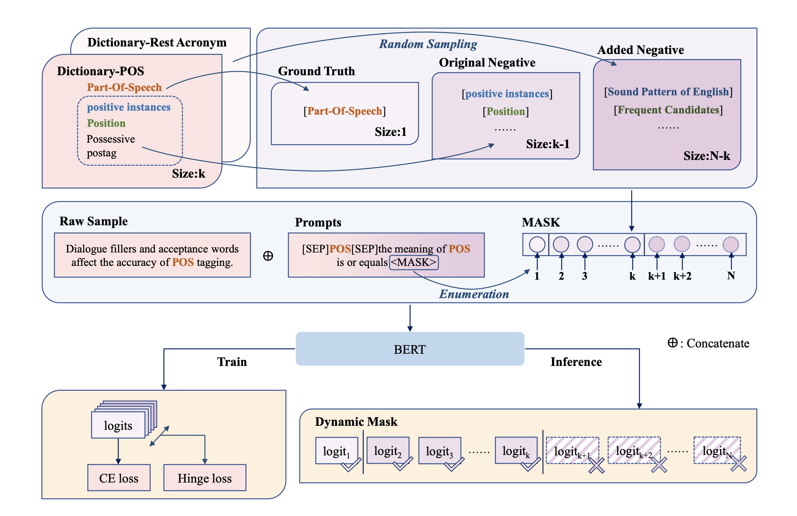

# Prompt-based Model for Acronym Disambiguation via Negative Sampling

This repo contains the code for our AAAI 2022 SDU Workshop paper:
<a href="" target="_blank"> Prompt-based Model for Acronym Disambiguation via Negative Sampling </a> by <a href="https://wutaiqiang.github.io" target="_blank">Taiqiang Wu</a>, Xingyu Bai, Yujiu Yang.

## Overview
In this paper, we proposed a prompt-based acronym disambiguation framework with a specially designed negative sampling strategy. Firstly, we design a prompt template and use the template to concatenate the acronym context and candidate expansions. Secondly, we utilize a pre-trained language model such as BERT to encode the combined context separately, followed by a linear layer to map the context vectors into logits. Since the size of candidate expansions for each acronym varies, we try to sample negative samples, thus padding the candidate expansions randomly. Finally, we consider the original negative expansions as hard negative samples and the added ones as easy negative samples, which can calculate an extra loss to build a more robust system. 


<div align=center>

</div>

Overview of our proposed framework. For acronym POS, there are k expansions in the dictionary. we adopt a sample strategy to sample N − k samples. We design a prompt template: [SEP] *acronym* [SEP] the meaning of *acronym* is or equals
*expansion*. After that, a BERT-based model is employed as dynamic mask to ignore the logits from added expansions.

## Reproduction

### Environment
Packages required:
```
torch >= 1.6
numpy
sklearn
transformers
```

### Dataset

Please refer to the https://github.com/amirveyseh/AAAI-22-SDU-shared-task-2-AD to get the dataset for Acronym Disambiguation task in SDU@AAAI-22.

Just put the fold "/data" in your project.

Also, you can use your own data and rewrite the code.

### Run the code

Just use the bash (set your own parameters in bash file first)
```
bash bash/start.sh
```

The result would be saved in $output_folder

Then get the score using the following command:
```
python scorer.py -g path/to/gold.json -p path/to/predictions.json
```

The --gap and --mu control the $\lambda$ and $\mu$ in Eq 3 .

## Citation

Please cite our paper if you find this paper helpful

```
@inproceedings{DBLP:conf/aaai/WuBY22,
  author       = {Taiqiang Wu and
                  Xingyu Bai and
                  Yujiu Yang},
  editor       = {Amir Pouran Ben Veyseh and
                  Franck Dernoncourt and
                  Thien Huu Nguyen and
                  Walter Chang and
                  Viet Dack Lai},
  title        = {Prompt-based Model for Acronym Disambiguation via Negative Sampling},
  booktitle    = {Proceedings of the Workshop on Scientific Document Understanding co-located
                  with 36th {AAAI} Conference on Artificial Inteligence, SDU@AAAI 2022,
                  Virtual Event, March 1, 2022},
  series       = {{CEUR} Workshop Proceedings},
  volume       = {3164},
  publisher    = {CEUR-WS.org},
  year         = {2022},
  url          = {https://ceur-ws.org/Vol-3164/paper26.pdf},
  timestamp    = {Fri, 10 Mar 2023 16:22:15 +0100},
  biburl       = {https://dblp.org/rec/conf/aaai/WuBY22.bib},
  bibsource    = {dblp computer science bibliography, https://dblp.org}
}
```

## Contact

If you have any question, please contact via github issue or email me through wtq20(AT)mails.tsinghua.edu.cn 
